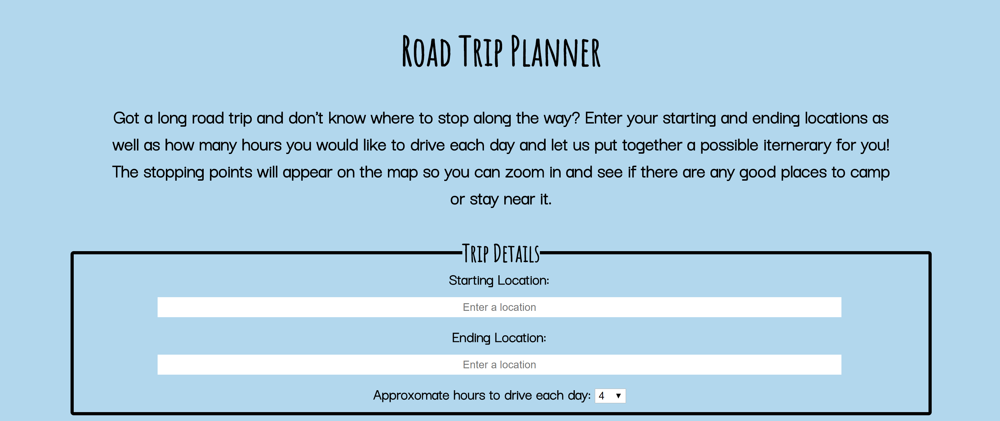
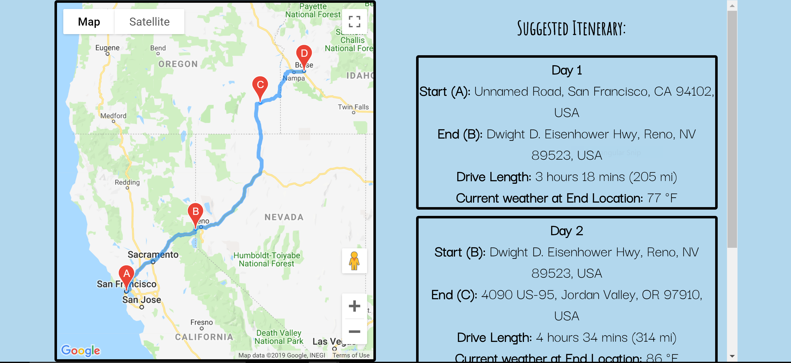

# road-trip-planner
This app is designed to help in the process of planning road trips. The user enters the location of the start and end of their trip as well as how many hours they would like to drive each day and then the app will create a possible itenerary for your trip. 

See it for yourself [here](https://vreplicon.github.io/road-trip-planner/)!

# Screenshots

User Input:

Results Section:

# Technologies Used
This app is based on the Google Maps Javascript API. In addition, it uses jQuery, HTML, and CSS.
